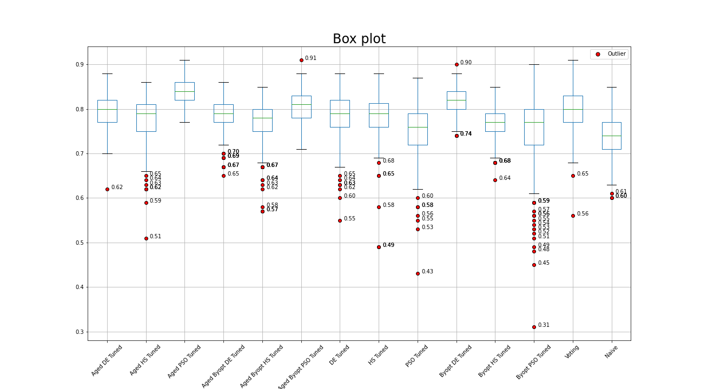

# AIT301 Project (Unveiling the Strength of Your CNN Model through Algorithmic Optimization)
CNN Model Hyperparameter Tuning Algorithms:
- Bayesian Optimization integrated with Differential Evolution, Harmony Search and Particle Swarm Optimization
- Differential Evolution
- Harmony Search
- Particle Swarm Optimization
  
Dataset:
- https://www.kaggle.com/datasets/umairshahpirzada/birds-20-species-image-classification

## Model Architecture

## Verification and Vlidation

## Visualization of Results

## Optimal Hyperparameters found

Click to expand/collapse the table

|                   | Aged DE Tuned | Aged HS Tuned | Aged PSO Tuned | Aged Byopt DE Tuned | Aged Byopt HS Tuned | Aged Byopt PSO Tuned | DE Tuned | HS Tuned | PSO Tuned | Byopt DE Tuned | Byopt HS Tuned | Byopt PSO Tuned | Naive | Voting |
|-------------------|---------------|---------------|----------------|---------------------|---------------------|----------------------|----------|----------|------------|----------------|----------------|------------------|-------|--------|
| Layer1_filter     | 32.00         | 32.00         | 64.00          | 32.00               | 64.00               | 64.00                | 64.00    | 32.00    | 64.00      | 32.00          | 32.00          | 64.00            | 32.00 | 32     |
| Layer1_act        | relu          | relu          | relu           | sigmoid             | sigmoid             | relu                 | relu     | relu     | relu       | sigmoid        | relu           | relu             | relu  | relu   |
| Layer2_filter     | 32.00         | 32.00         | 32.00          | 32.00               | 32.00               | 64.00                | 32.00    | 32.00    | 64.00      | 32.00          | 64.00          | 64.00            | 32.00 | 32     |
| Layer2_act        | sigmoid       | relu          | sigmoid        | sigmoid             | relu                | sigmoid             | sigmoid  | relu     | sigmoid   | relu           | sigmoid        | sigmoid          | relu  | sigmoid|
| Drop1             | 0.45          | 0.40          | 0.25           | 0.50                | 0.50                | 0.50                | 0.40     | 0.25     | 0.25      | 0.25           | 0.25           | 0.30             | 0.25  | 0.25   |
| Layer3_filter     | 32.00         | 128.00        | 32.00          | 32.00               | 128.00              | 128.00               | 64.00    | 64.00    | 64.00      | 128.00         | 128.00         | 32.00            | 64.00 | 128    |
| Layer3_act        | sigmoid       | relu          | relu           | relu                | sigmoid             | sigmoid             | relu     | relu     | sigmoid   | relu           | sigmoid        | relu             | relu  | relu   |
| Layer4_filter     | 32.00         | 64.00         | 64.00          | 32.00               | 32.00               | 32.00               | 32.00    | 64.00    | 64.00      | 32.00          | 32.00          | 32.00            | 64.00 | 32     |
| Layer4_act        | relu          | relu          | relu           | sigmoid             | sigmoid             | relu                | sigmoid  | relu     | relu      | relu           | sigmoid        | relu             | relu  | relu   |
| Drop2             | 0.45          | 0.50          | 0.50           | 0.25                | 0.50                | 0.35                | 0.50     | 0.25     | 0.30      | 0.25           | 0.50           | 0.40             | 0.25  | 0.5    |
| Layer5_filter     | 256.00        | 64.00         | 256.00         | 256.00              | 256.00              | 64.00               | 256.00   | 256.00   | 128.00    | 256.00         | 128.00         | 64.00            | 128.00| 256    |
| Layer5_act        | relu          | sigmoid       | sigmoid        | sigmoid             | relu                | sigmoid             | relu     | relu     | sigmoid   | sigmoid        | sigmoid        | sigmoid          | relu  | sigmoid|
| Layer6_filter     | 64.00         | 64.00         | 256.00         | 64.00               | 64.00               | 256.00              | 64.00    | 64.00    | 256.00    | 256.00         | 64.00          | 256.00           | 128.00| 64     |
| Layer6_act        | relu          | sigmoid       | relu           | relu                | relu                | relu                | relu     | relu     | sigmoid   | sigmoid        | sigmoid        | relu             | relu  | relu   |
| Drop3             | 0.50          | 0.50          | 0.50           | 0.50                | 0.50                | 0.25                | 0.35     | 0.50     | 0.50      | 0.35           | 0.45           | 0.25             | 0.25  | 0.5    |
| Layer7_units      | 256.00        | 1,024.00      | 512.00         | 1,024.00            | 256.00              | 1,024.00            | 128.00   | 512.00   | 1,024.00  | 1,024.00       | 512.00         | 512.00           | 128.00| 1024   |
| Layer7_act        | relu          | sigmoid       | sigmoid        | sigmoid             | relu                | relu                | sigmoid  | relu     | relu      | relu           | sigmoid        | relu             | relu  | relu   |
| Drop4             | 0.25          | 0.25          | 0.25           | 0.25                | 0.25                | 0.25                | 0.45     | 0.40     | 0.30      | 0.50           | 0.25           | 0.40             | 0.25  | 0.25   |
| optimizer         | nadam         | nadam         | sgd            | adam                | adam                | sgd                 | rmsprop  | nadam    | nadam     | sgd            | sgd            | nadam            | adam  | nadam  |
| epochs            | 30.00         | 16.00         | 30.00          | 30.00               | 23.00               | 15.00               | 24.00    | 30.00    | 24.00     | 30.00          | 26.00          | 22.00            | 30.00 | 30     |
| batch_size        | 8.00          | 16.00         | 8.00           | 8.00                | 16.00               | 8.00                | 32.00    | 16.00    | 32.00     | 8.00           | 8.00           | 64.00            | 16.00| 8      |
| learning_rate     | 0.001217      | 0.001000      | 0.010000       | 0.001000            | 0.001084            | 0.010000            | 0.001018 | 0.001147 | 0.001000  | 0.010000       | 0.010000       | 0.001508         | 0.001 | 0.001  |
| best_fitness      | 0.94          | 0.87          | 0.90           | 0.86                | 0.86                | 0.88                | 0.88     | 0.89     | 0.89      | 0.90           | 0.85           | 0.85             |       |        |

## Analysis

Click to expand/collapse the table

| Model                | Best Accuracy | Max Accuracy | Min Accuracy | Mean Accuracy | PI(Best/N) | PI(Mean/N) | PI(Max/N) | PRD(Max/Best)| Skewness | Kurtosis | Std     |
|----------------------|---------------|--------------|--------------|---------------|------------|------------|-----------|--------------|----------|----------|---------|
| Aged DE Tuned        | 94%           | 88%          | 62%          | 79.706666%    | 10.588235% | 7.998735%  | 3.529408% | 6.590000%    | -0.563683| 1.050164 | 0.037693|
| Aged HS Tuned        | 87%           | 86%          | 51%          | 77.773333%    | 2.352941%  | 5.379161%  | 1.176469% | 1.160000%    | -1.318221| 3.678665 | 0.048656|
| Aged PSO Tuned       | 90%           | 91%          | 77%          | 83.883333%    | 5.882353%  | 13.657919% | 7.058824% | 1.100000%    | -0.174784| -0.238688| 0.025726|
| Aged Byopt DE Tuned  | 86%           | 86%          | 65%          | 78.630000%    | 1.176471%  | 6.539903%  | 1.176469% | 0.000000%    | -0.654741| 1.080759 | 0.035282|
| Aged Byopt HS Tuned  | 86%           | 85%          | 57%          | 77.023333%    | 1.176471%  | 4.362946%  | 0.000000% | 1.170000%    | -1.385112| 3.628307 | 0.044274|
| Aged Byopt PSO Tuned | 88%           | 91%          | 71%          | 80.616666%    | 3.529412%  | 9.231742%  | 7.058824% | 3.350000%    | -0.183008| 0.020675 | 0.034462|
| DE Tuned             | 88%           | 88%          | 55%          | 78.386666%    | 3.529412%  | 6.210198%  | 3.529408% | 0.000000%    | -1.246771| 2.593043 | 0.048802|
| HS Tuned             | 89%           | 88%          | 49%          | 78.243333%    | 4.705882%  | 6.015988%  | 3.529408% | 1.130000%    | -1.900475| 9.056414 | 0.047854|
| PSO Tuned            | 89%           | 87%          | 43%          | 75.363333%    | 4.705882%  | 2.113725%  | 2.352939% | 2.270000%    | -1.210384| 3.374937 | 0.059881|
| Byopt DE Tuned       | 90%           | 90%          | 74%          | 81.613333%    | 5.882353%  | 10.582177% | 5.882347% | 0.000000%    | -0.197353| -0.005680| 0.027778|
| Byopt HS Tuned       | 85%           | 85%          | 64%          | 77.053333%    | 0.000000%  | 4.403595%  | 0.000000% | 0.000000%    | -0.413858| 0.649220 | 0.033015|
| Byopt PSO Tuned      | 85%           | 90%          | 31%          | 75.266667%    | 0.000000%  | 1.982747%  | 5.882347% | 5.710000%    | -1.670602| 4.609862 | 0.078290|
| Voting               | 91%           | 91%          | 56%          | 80.013333%    | 7.058827%  | 8.414254%  | 7.058824% | 0.000000%    | -0.879668| 2.813564 | 0.043524|
| Naive                | 85%           | 85%          | 60%          | 73.803333%    | 0.000000%  | 0.000000%  | 0.000000% | 0.000000%    | -0.193603| 0.310538 | 0.042613|

